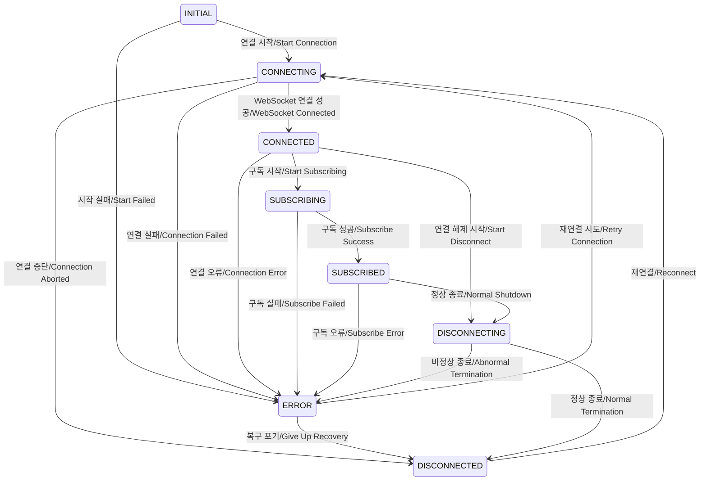

ExchangeConnector의 상태 전이 패턴을 분석하겠습니다:

주요 상태 전이 패턴 분석:

1. 정상 시작 및 구독 흐름:

    - INITIAL → CONNECTING → CONNECTED → SUBSCRIBING → SUBSCRIBED
    - 각 단계별 실패 시 ERROR 상태로 전환
    - WebSocketManager의 상태와 동기화되어 움직임

2. 정상 종료 흐름:

    - SUBSCRIBED → DISCONNECTING → DISCONNECTED
    - CONNECTED → DISCONNECTING → DISCONNECTED
    - 안전한 리소스 정리를 보장

3. 오류 처리 및 복구:

    - 모든 상태에서 ERROR로 전환 가능
    - ERROR → CONNECTING (재시도)
    - ERROR → DISCONNECTED (복구 포기)
    - WebSocketManager의 재연결 성공 시 자동 재구독

4. 특이사항:
    - WebSocketManager와 상태 동기화
    - 구독 상태(SUBSCRIBING, SUBSCRIBED) 추가 관리
    - 구독 정보 유지 및 복구 시 재사용

이러한 상태 전이 패턴은 ExchangeConnector가:

1. WebSocketManager의 연결 상태를 추적
2. 구독 상태를 독립적으로 관리
3. 장애 상황에서 적절한 복구 수행
4. 안전한 종료 처리 보장

이 분석을 바탕으로 현재 구현이 적절한지 검토할 수 있습니다.
