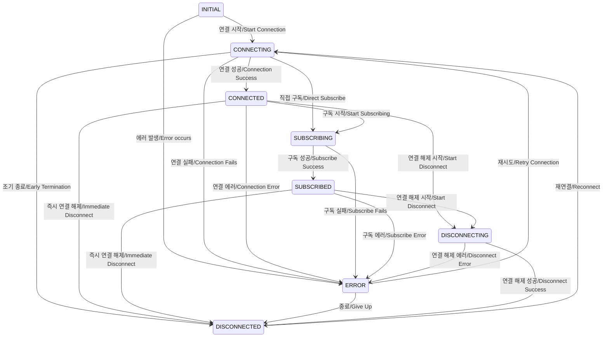

주요 상태 전이 패턴 분석 (State Transition Pattern Analysis):

1. 정상 흐름 (Normal Flow):

    - INITIAL → CONNECTING → CONNECTED → SUBSCRIBING → SUBSCRIBED
      (초기 → 연결 중 → 연결됨 → 구독 중 → 구독됨)
    - SUBSCRIBED → DISCONNECTING → DISCONNECTED
      (구독됨 → 연결 해제 중 → 연결 해제됨)

2. 즉시 종료 경로 (Immediate Termination Paths):

    - CONNECTED → DISCONNECTED (연결됨 → 연결 해제됨)
    - SUBSCRIBED → DISCONNECTED (구독됨 → 연결 해제됨)

3. 오류 처리 (Error Handling):

    - 모든 상태에서 ERROR 상태로 전이 가능
      (All states can transition to ERROR)
    - ERROR → CONNECTING (재시도/Retry)
    - ERROR → DISCONNECTED (포기/Give up)

4. 특이사항 (Special Cases):
    - CONNECTING에서 SUBSCRIBING으로 직접 전이 가능
      (Direct transition from CONNECTING to SUBSCRIBING possible)
    - DISCONNECTED는 CONNECTING으로만 전이 가능
      (DISCONNECTED can only transition to CONNECTING)
    - ERROR 상태는 CONNECTING 또는 DISCONNECTED로만 전이 가능
      (ERROR state can only transition to CONNECTING or DISCONNECTED)

이 다이어그램은 WebSocket 연결의 전체 라이프사이클을 보여주며, 정상 흐름과 예외 상황을 모두 포함하고 있습니다.
(This diagram shows the complete lifecycle of a WebSocket connection, including both normal flow and exception handling.)
