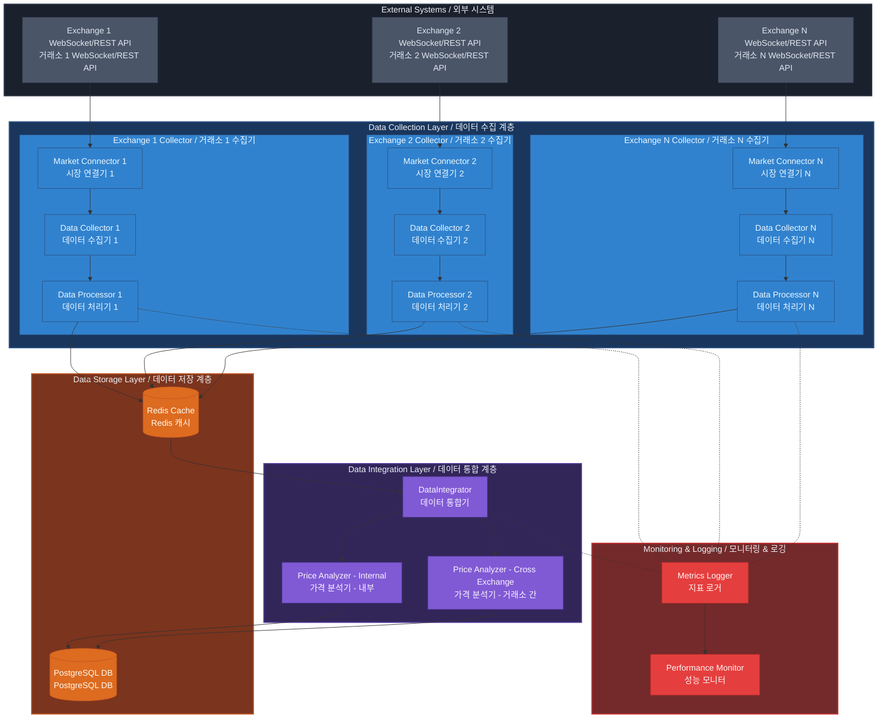

# XSpreadProfit 시스템 아키텍처 설계서

문서 번호: ARCH-002  
버전: 2.0  
작성일: 2024-11-30  
작성자: System Architect  
승인자: Project Owner

## 문서 개정 이력

| 버전 | 일자       | 작성자           | 변경 내용           | 승인자        |
| ---- | ---------- | ---------------- | ------------------- | ------------- |
| 1.0  | 2024-11-30 | System Architect | 최초 작성           | Project Owner |
| 2.0  | 2024-11-30 | System Architect | 독립 실행 구조 반영 | Project Owner |

## 목차

1. [개요](#1-개요)
2. [시스템 구조](#2-시스템-구조)
3. [컴포넌트 설계](#3-컴포넌트-설계)
4. [데이터 흐름](#4-데이터-흐름)
5. [인터페이스 설계](#5-인터페이스-설계)
6. [성능 및 확장성](#6-성능-및-확장성)
7. [배포 전략](#7-배포-전략)

## 1. 개요

### 1.1 목적

본 문서는 XSpreadProfit 시스템의 전체 아키텍처를 정의하고, 각 컴포넌트의 설계 원칙과 독립적 실행 구조에 대한 세부 구현 지침을 제공한다.

### 1.2 범위

-   거래소별 독립 수집기 구조 정의
-   데이터 통합기 독립 실행 구조
-   컴포넌트 간 상호작용 방식
-   데이터 저장소 활용 방안
-   모니터링 시스템 구성

### 1.3 용어 정의

-   Exchange Collector: 개별 거래소의 데이터 수집 파이프라인
-   Market Connector: 거래소 API 연동 컴포넌트
-   Data Integrator: 수집된 데이터의 통합 분석 컴포넌트

## 2. 시스템 구조

### 2.1 아키텍처 원칙

1. 독립성

    - 거래소별 수집기의 완전한 독립 실행
    - 데이터 통합기의 자율적 운영
    - 컴포넌트 간 느슨한 결합

2. 확장성

    - 거래소 추가에 따른 수집기 독립 확장
    - 분석 로직의 유연한 확장
    - 스케일 아웃 가능한 구조

3. 안정성
    - 장애 격리
    - 자동 복구
    - 상태 모니터링

### 2.2 시스템 구성도



### 2.3 주요 컴포넌트 설명

#### 2.3.1 거래소별 수집기 (Exchange Collector)

-   독립적인 수집 파이프라인 구성
-   자체 설정 및 리소스 관리
-   구성 요소
    -   Market Connector: API 연동
    -   Data Collector: 데이터 수집
    -   Data Processor: 전처리 및 검증

#### 2.3.2 데이터 통합기 (Data Integrator)

-   독립적인 분석 프로세스
-   Redis 기반 데이터 조회
-   분석 결과의 독립적 저장

## 3. 컴포넌트 설계

### 3.1 Exchange Collector 상세 설계

```typescript
interface ExchangeCollector {
    readonly exchangeId: string;
    readonly marketConnector: MarketConnector;
    readonly dataProcessor: DataProcessor;

    start(): Promise<void>;
    stop(): Promise<void>;
    getStatus(): CollectorStatus;
}

class ExchangeCollectorImpl implements ExchangeCollector {
    constructor(
        private config: CollectorConfig,
        private redisClient: RedisClient,
        private metricsLogger: MetricsLogger
    ) {}

    // 구현 상세...
}
```

### 3.2 Data Integrator 상세 설계

```typescript
interface DataIntegrator {
    readonly analyzers: PriceAnalyzer[];

    start(): Promise<void>;
    stop(): Promise<void>;
    getAnalysisStatus(): AnalysisStatus;
}

class DataIntegratorImpl implements DataIntegrator {
    constructor(
        private config: IntegratorConfig,
        private redisClient: RedisClient,
        private postgresClient: PostgresClient,
        private metricsLogger: MetricsLogger
    ) {}

    // 구현 상세...
}
```

## 4. 데이터 흐름

### 4.1 데이터 수집 흐름

1. Exchange Collector

    - WebSocket/REST API 데이터 수신
    - 데이터 검증 및 정규화
    - Redis 캐시 저장
    - 독립적 메트릭 생성

2. Data Integrator
    - Redis 데이터 주기적 조회
    - 가격차 분석 수행
    - PostgreSQL 결과 저장
    - 분석 메트릭 생성

## 5. 인터페이스 설계

### 5.1 데이터 저장소 인터페이스

```typescript
interface DataStore {
    // Redis 인터페이스
    saveMarketData(data: MarketData): Promise<void>;
    getMarketData(exchangeId: string): Promise<MarketData[]>;

    // PostgreSQL 인터페이스
    saveAnalysisResult(result: AnalysisResult): Promise<void>;
    getAnalysisHistory(params: QueryParams): Promise<AnalysisResult[]>;
}
```

## 6. 성능 및 확장성

### 6.1 성능 요구사항

-   수집기별 독립적 성능 보장
-   실시간 데이터 처리 지연 최소화
-   리소스 사용 효율성

### 6.2 확장성 전략

-   수평적 확장 가능한 구조
-   신규 거래소 추가 용이성
-   분석 로직 확장 유연성

## 7. 배포 전략

### 7.1 컨테이너화

-   컴포넌트별 독립 컨테이너
-   설정 외부화
-   리소스 제한 설정

### 7.2 운영 환경

-   수집기별 독립 배포
-   통합기 독립 배포
-   모니터링 시스템 구성
