# XSpreadProfit 시스템 클래스 설계서

문서 번호: CLASS-002  
버전: 2.0  
작성일: 2024-11-30  
작성자: System Architect  
승인자: Project Owner

## 문서 개정 이력

| 버전 | 일자       | 작성자           | 변경 내용                               | 승인자        |
| ---- | ---------- | ---------------- | --------------------------------------- | ------------- |
| 1.0  | 2024-11-30 | System Architect | 최초 작성                               | Project Owner |
| 2.0  | 2024-11-30 | System Architect | Factory 패턴, 상태 관리, 에러 처리 추가 | Project Owner |

## 목차

1. [개요](#1-개요)
2. [클래스 다이어그램](#2-클래스-다이어그램)
3. [핵심 인터페이스](#3-핵심-인터페이스)
4. [컴포넌트별 클래스 설계](#4-컴포넌트별-클래스-설계)
5. [클래스 간 상호작용](#5-클래스-간-상호작용)
6. [확장 전략](#6-확장-전략)

## 1. 개요

### 1.1 목적

본 문서는 XSpreadProfit 시스템의 클래스 수준 설계를 정의하고, 각 클래스의 책임과 상호작용 방식을 명세합니다.

### 1.2 설계 원칙

-   단일 책임 원칙 (SRP) 준수
-   인터페이스 기반 설계
-   의존성 주입 패턴 적용
-   확장 가능한 구조 유지

### 1.3 범위

-   핵심 인터페이스 정의
-   컴포넌트별 클래스 설계
-   클래스 간 의존성 관리
-   확장 포인트 정의

## 2. 클래스 다이어그램

### 2.1 전체 시스템 클래스 구조

```mermaid
classDiagram
    %% Interfaces
    class MarketConnector {
        <<interface>>
        +connect() Promise~void~
        +subscribe(symbols: string[]) Promise~void~
        +disconnect() Promise~void~
        +getStatus() ConnectionStatus
    }

    class DataProcessor {
        <<interface>>
        +process(data: RawMarketData) Promise~ProcessedMarketData~
        +validate(data: ProcessedMarketData) boolean
    }

    class DataStore {
        <<interface>>
        +save(data: ProcessedMarketData) Promise~void~
        +get(query: DataQuery) Promise~ProcessedMarketData[]~
        +delete(query: DataQuery) Promise~void~
    }

    class PriceAnalyzer {
        <<interface>>
        +analyze(data: AnalysisInput) Promise~AnalysisResult~
        +getAnalysisType() AnalysisType
    }

    %% Abstract Classes
    class BaseCollector {
        <<abstract>>
        #config: CollectorConfig
        #connector: MarketConnector
        #processor: DataProcessor
        #store: DataStore
        #errorHandler: CollectorErrorHandler
        #stateManager: CollectorStateManager
        #logger: Logger
        +start()* Promise~void~
        +stop()* Promise~void~
    }

    class BaseDataProcessor {
        #validator: DataValidator
        #normalizer: DataNormalizer
        #logger: Logger
        +process(data: RawMarketData) Promise~ProcessedMarketData~
        +validate(data: ProcessedMarketData) boolean
    }

    %% Factory
    class ExchangeCollectorFactory {
        -connectorMap: Map
        -processorMap: Map
        +createCollector(config: ExchangeConfig) BaseCollector
    }

    %% Error Handler
    class CollectorErrorHandler {
        -maxRetries: number
        -retryCount: Map
        +handleError(error: CollectorError) Promise~void~
    }

    %% State Manager
    class CollectorStateManager {
        -state: CollectorState
        -metrics: CollectorMetrics
        +getState() CollectorStatus
        +updateState(state: CollectorState) void
    }

    %% Concrete Classes
    class BinanceCollector {
        -handleWebSocketMessage(message: any)
        -handleError(error: Error)
        +start() Promise~void~
        +stop() Promise~void~
    }

    class BybitCollector {
        -handleWebSocketMessage(message: any)
        -handleError(error: Error)
        +start() Promise~void~
        +stop() Promise~void~
    }

    class BinanceDataProcessor {
        -parseMessage(message: any)
        -validateBinanceData(data: any)
    }

    class RedisStore {
        -client: RedisClient
        -serializer: DataSerializer
        -logger: Logger
        +save() Promise~void~
        +get() Promise~ProcessedMarketData[]~
    }

    class PostgresStore {
        -client: PostgresClient
        -queryBuilder: QueryBuilder
        -logger: Logger
        +save() Promise~void~
        +get() Promise~ProcessedMarketData[]~
    }

    class InternalPriceAnalyzer {
        -store: DataStore
        -calculator: SpreadCalculator
        -logger: Logger
        +analyze() Promise~AnalysisResult~
    }

    class CrossExchangePriceAnalyzer {
        -store: DataStore
        -calculator: SpreadCalculator
        -logger: Logger
        +analyze() Promise~AnalysisResult~
    }

    class MetricsCollector {
        -store: MetricsStore
        -aggregator: MetricsAggregator
        -logger: Logger
        +collectMetrics() Promise~void~
    }

    %% Relationships
    ExchangeCollectorFactory ..> BaseCollector
    BaseCollector ..|> MarketConnector
    BaseCollector ..|> DataProcessor
    BaseCollector ..|> DataStore
    BaseCollector --> CollectorErrorHandler
    BaseCollector --> CollectorStateManager

    BinanceCollector --|> BaseCollector
    BybitCollector --|> BaseCollector

    BaseDataProcessor ..|> DataProcessor
    BinanceDataProcessor --|> BaseDataProcessor

    RedisStore ..|> DataStore
    PostgresStore ..|> DataStore

    InternalPriceAnalyzer ..|> PriceAnalyzer
    CrossExchangePriceAnalyzer ..|> PriceAnalyzer

    BinanceCollector ..> BinanceDataProcessor
    BinanceCollector ..> RedisStore
    BinanceCollector ..> MetricsCollector

    InternalPriceAnalyzer ..> DataStore
    CrossExchangePriceAnalyzer ..> DataStore
```



## 3. 핵심 인터페이스

### 3.1 MarketConnector 인터페이스

```typescript
interface MarketConnector {
    connect(): Promise<void>;
    subscribe(symbols: string[]): Promise<void>;
    disconnect(): Promise<void>;
    getStatus(): ConnectionStatus;
}
```

**책임**:

-   거래소 API 연결 관리
-   시세 데이터 구독
-   연결 상태 모니터링

### 3.2 DataProcessor 인터페이스

```typescript
interface DataProcessor {
    process(data: RawMarketData): Promise<ProcessedMarketData>;
    validate(data: ProcessedMarketData): boolean;
}
```

**책임**:

-   원시 데이터 처리
-   데이터 유효성 검증
-   데이터 정규화

### 3.3 DataStore 인터페이스

```typescript
interface DataStore {
    save(data: ProcessedMarketData): Promise<void>;
    get(query: DataQuery): Promise<ProcessedMarketData[]>;
    delete(query: DataQuery): Promise<void>;
}
```

**책임**:

-   데이터 영속성 관리
-   쿼리 처리
-   캐시 관리

## 4. 컴포넌트별 클래스 설계

### 4.1 수집기(Collector) 컴포넌트

#### 4.1.1 Factory 패턴

```typescript
class ExchangeCollectorFactory {
    private readonly connectorMap: Map<string, MarketConnector>;
    private readonly processorMap: Map<string, DataProcessor>;

    createCollector(exchangeConfig: ExchangeConfig): BaseCollector {
        const connector = this.getConnector(exchangeConfig.exchangeId);
        const processor = this.getProcessor(exchangeConfig.exchangeId);
        const errorHandler = new CollectorErrorHandler(exchangeConfig);
        const stateManager = new CollectorStateManager();

        return new BaseCollector(
            exchangeConfig,
            connector,
            processor,
            errorHandler,
            stateManager
        );
    }
}
```

#### 4.1.2 상태 관리

```typescript
class CollectorStateManager {
    private state: CollectorState = "INIT";
    private metrics: CollectorMetrics = {
        processedCount: 0,
        errorCount: 0,
        lastUpdateTime: new Date(),
        latency: 0,
    };

    getState(): CollectorStatus {
        return {
            state: this.state,
            metrics: this.metrics,
            health: this.calculateHealth(),
        };
    }

    updateState(
        newState: CollectorState,
        metrics?: Partial<CollectorMetrics>
    ): void {
        this.state = newState;
        if (metrics) {
            Object.assign(this.metrics, metrics);
        }
    }
}
```

#### 4.1.3 에러 처리

```typescript
class CollectorErrorHandler {
    private readonly maxRetries: number;
    private retryCount: Map<string, number> = new Map();

    async handleError(error: CollectorError): Promise<void> {
        const errorType = this.classifyError(error);

        switch (errorType) {
            case "CONNECTION":
                await this.handleConnectionError(error);
                break;
            case "RATE_LIMIT":
                await this.handleRateLimitError(error);
                break;
            case "DATA":
                await this.handleDataError(error);
                break;
            default:
                this.escalateError(error);
        }
    }
}
```

#### 4.1.4 통합 구현

```typescript
class BaseCollector {
    constructor(
        protected readonly config: CollectorConfig,
        protected readonly connector: MarketConnector,
        protected readonly processor: DataProcessor,
        protected readonly errorHandler: CollectorErrorHandler,
        protected readonly stateManager: CollectorStateManager,
        protected readonly logger: Logger
    ) {}

    async start(): Promise<void> {
        try {
            this.stateManager.updateState("STARTING");
            await this.connector.connect();
            this.stateManager.updateState("RUNNING");
        } catch (error) {
            await this.errorHandler.handleError(error);
            this.stateManager.updateState("ERROR");
        }
    }

    protected async handleData(data: MarketData): Promise<void> {
        try {
            const startTime = Date.now();
            const processed = await this.processor.process(data);
            await this.store.save(processed);

            this.stateManager.updateState("RUNNING", {
                processedCount: 1,
                latency: Date.now() - startTime,
            });
        } catch (error) {
            await this.errorHandler.handleError(error);
        }
    }
}
```

### 4.2 타입 정의

```typescript
type ConnectionStatus = "CONNECTED" | "DISCONNECTED" | "CONNECTING" | "ERROR";

interface CollectorConfig {
    exchangeId: string;
    apiKey: string;
    apiSecret: string;
    symbols: string[];
}

type CollectorState = "INIT" | "STARTING" | "RUNNING" | "ERROR" | "STOPPED";

interface CollectorMetrics {
    processedCount: number;
    errorCount: number;
    lastUpdateTime: Date;
    latency: number;
}

interface HealthStatus {
    isHealthy: boolean;
    lastCheckTime: Date;
    issues: string[];
}

interface CollectorStatus {
    state: CollectorState;
    metrics: CollectorMetrics;
    health: HealthStatus;
}

type ErrorType = "CONNECTION" | "RATE_LIMIT" | "DATA" | "SYSTEM";

interface CollectorError extends Error {
    code: string;
    type: ErrorType;
    retryable: boolean;
}
```

## 5. 클래스 간 상호작용

### 5.1 데이터 수집 플로우

1. Collector 초기화

    - Factory를 통한 인스턴스 생성
    - 의존성 주입
    - 상태 초기화

2. 데이터 수집 및 처리

    - WebSocket 연결 및 구독
    - 데이터 수신 및 처리
    - 상태 및 메트릭 업데이트

3. 에러 처리
    - 에러 감지 및 분류
    - 자동 복구 시도
    - 상태 업데이트

### 5.2 가격 분석 플로우

1. 데이터 조회
2. 분석 수행
3. 결과 저장

## 6. 확장 전략

### 6.1 새로운 거래소 추가

1. Factory에 새로운 거래소 타입 추가
2. Collector 클래스 구현
3. 설정 추가

### 6.2 새로운 분석기 추가

1. PriceAnalyzer 구현
2. 분석 로직 정의
3. 결과 처리 구현

[에러 코드 정의 테이블은 기존과 동일]
